# Materi Angular 20+ — RxJS Store dengan BehaviorSubject, Subject, Operator & Lifecycle

Materi ini berfokus pada pembuatan **state/store sederhana berbasis RxJS** tanpa NgRx, dengan konsep:

* `Observable`
* `Subject`
* `BehaviorSubject`
* `map()`
* `filter()`
* `switchMap()`
* `take()`
* `catchError()`
* `finalize()`
* `takeUntilDestroyed()`
* `async` pipe
* lifecycle subscription
* pemisahan API Service dan Store

---

# 1. Mental Model

Gunakan mental model berikut:

```text
API / Router / Form
        ↓
    Observable
        ↓
      pipe()
        ↓
 RxJS Operators
        ↓
      Store
        ↓
 BehaviorSubject
        ↓
   Observable State
        ↓
 Component / HTML
```

Flow:

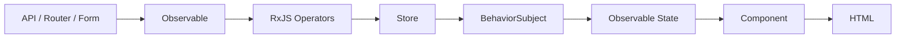

---

# 2. Apa Itu Observable?

`Observable` adalah aliran data yang dapat menghasilkan value sekarang maupun nanti.

Contoh dari Angular:

```ts
this.http.get<User[]>('/api/users');
```

Return-nya:

```ts
Observable<User[]>
```

Contoh lainnya:

```ts
this.route.paramMap

this.router.events

this.searchControl.valueChanges
```

---

# 3. Apa Itu Subject?

`Subject` adalah Observable yang dapat kita trigger secara manual menggunakan:

```ts
.next()
```

Contoh:

```ts
private readonly refresh$ =
  new Subject<void>();
```

Trigger:

```ts
refresh(): void {
  this.refresh$.next();
}
```

Mental model:

```text
Subject
= EVENT
```

Contoh penggunaan:

```text
Refresh diklik
Retry diklik
Submit dilakukan
Logout diminta
Reload diminta
```

---

# 4. Contoh Subject untuk Refresh

```ts
private readonly refresh$ =
  new Subject<void>();

readonly applications$ =
  this.refresh$.pipe(
    startWith(undefined),
    switchMap(() =>
      this.loanService.getApplications()
    )
  );

refresh(): void {
  this.refresh$.next();
}
```

Flow:

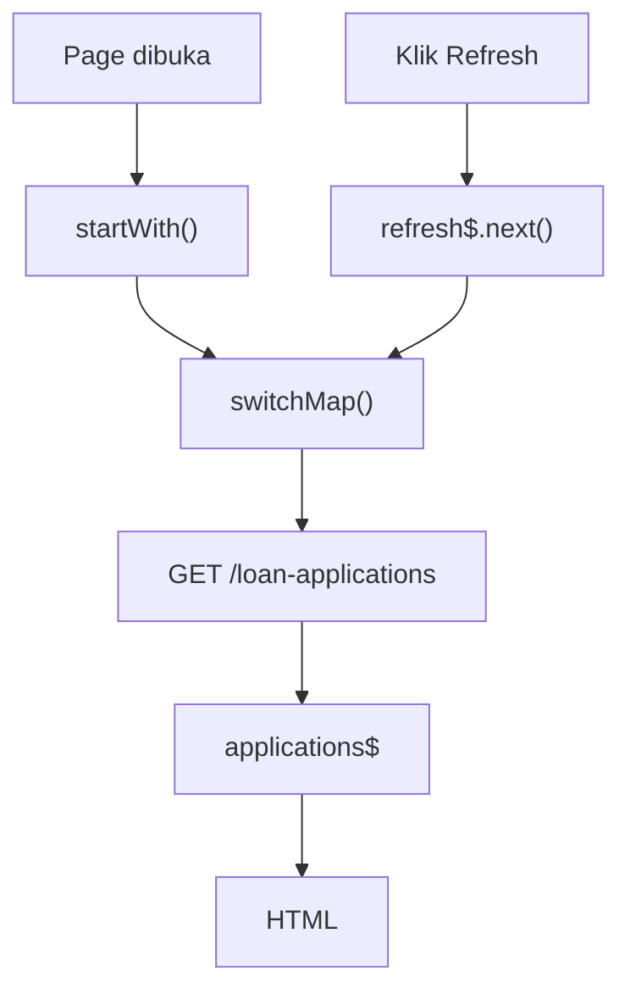

Kenapa menggunakan `Subject`?

Karena kita hanya ingin mengetahui:

```text
refresh terjadi
```

Kita tidak membutuhkan:

```text
nilai refresh saat ini
```

---

# 5. Apa Itu BehaviorSubject?

`BehaviorSubject` adalah Subject yang menyimpan **nilai terbaru**.

Contoh:

```ts
private readonly applicationsSubject =
  new BehaviorSubject<LoanApplication[]>([]);
```

Update:

```ts
this.applicationsSubject.next(applications);
```

Expose:

```ts
readonly applications$ =
  this.applicationsSubject.asObservable();
```

Mental model:

```text
BehaviorSubject
= STATE
```

Contoh:

```text
Current User
Selected Loan
Loan Application List
Master Product
Current Branch
Loading State
```

---

# 6. Subject vs BehaviorSubject

| Kebutuhan                | Gunakan           |
| ------------------------ | ----------------- |
| Refresh button           | `Subject`         |
| Retry button             | `Subject`         |
| Submit event             | `Subject`         |
| Selected loan            | `BehaviorSubject` |
| Current user             | `BehaviorSubject` |
| Master data              | `BehaviorSubject` |
| Current application list | `BehaviorSubject` |

Rule sederhana:

```text
Something happened
→ Subject

Something has current value
→ BehaviorSubject
```

---

# 7. Kenapa Subject Sebaiknya Private?

Hindari:

```ts
readonly applications =
  new BehaviorSubject<LoanApplication[]>([]);
```

Component lain dapat melakukan:

```ts
store.applications.next([]);
```

Ini membuat state dapat dimodifikasi dari mana saja.

Lebih baik:

```ts
private readonly applicationsSubject =
  new BehaviorSubject<LoanApplication[]>([]);

readonly applications$ =
  this.applicationsSubject.asObservable();
```

Mutation melalui method:

```ts
loadApplications(): void {
}
```

Flow:

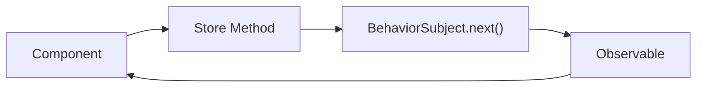

---

# 8. Struktur API Service dan Store

Pisahkan:

```text
API Service
= komunikasi dengan backend

Store
= menyimpan dan mengatur state
```

Contoh struktur:

```text
loan-application/
├── models/
│   └── loan-application.model.ts
│
├── services/
│   └── loan-application.service.ts
│
├── store/
│   └── loan-application.store.ts
│
└── pages/
    ├── loan-list/
    └── loan-detail/
```

---

# 9. API Service

```ts
@Injectable({
  providedIn: 'root',
})
export class LoanApplicationService {
  private readonly http =
    inject(HttpClient);

  getApplications(): Observable<LoanApplication[]> {
    return this.http.get<LoanApplication[]>(
      '/api/loan-applications'
    );
  }

  getDetail(
    id: number
  ): Observable<LoanApplicationDetail> {
    return this.http.get<LoanApplicationDetail>(
      `/api/loan-applications/${id}`
    );
  }
}
```

Service tidak perlu menyimpan state.

Tugasnya:

```text
request
↓
response
```

---

# 10. Membuat Store

```ts
@Injectable({
  providedIn: 'root',
})
export class LoanApplicationStore {
  private readonly service =
    inject(LoanApplicationService);

  private readonly applicationsSubject =
    new BehaviorSubject<LoanApplication[]>([]);

  private readonly selectedApplicationSubject =
    new BehaviorSubject<LoanApplicationDetail | null>(
      null
    );

  private readonly loadingSubject =
    new BehaviorSubject(false);

  private readonly errorSubject =
    new BehaviorSubject<string | null>(null);

  readonly applications$ =
    this.applicationsSubject.asObservable();

  readonly selectedApplication$ =
    this.selectedApplicationSubject.asObservable();

  readonly loading$ =
    this.loadingSubject.asObservable();

  readonly error$ =
    this.errorSubject.asObservable();
}
```

State:

```text
applications
→ list

selectedApplication
→ detail

loading
→ status request

error
→ error message
```

---

# 11. `map()`

`map()` digunakan untuk **mengubah value**.

Contoh route:

```ts
this.route.paramMap.pipe(
  map(params =>
    params.get('id')
  )
);
```

Awalnya:

```text
ParamMap
```

menjadi:

```text
string | null
```

Contoh lain:

```ts
map(response =>
  response.data
)
```

Mental model:

```text
VALUE A
  ↓
 map
  ↓
VALUE B
```

---

# 12. Jangan Gunakan `map()` untuk HTTP Baru

Kurang tepat:

```ts
map(id =>
  this.service.getDetail(id)
)
```

Hasilnya:

```text
Observable<Observable<LoanDetail>>
```

Untuk berpindah ke Observable lain gunakan:

```ts
switchMap()
```

---

# 13. `filter()`

`filter()` digunakan untuk membuang emission yang tidak memenuhi kondisi.

Contoh:

```ts
filter((id): id is string =>
  id !== null
)
```

Flow:

```text
101
null
102
null
103
```

setelah filter:

```text
101
102
103
```

Contoh lengkap:

```ts
this.route.paramMap.pipe(
  map(params => params.get('id')),
  filter((id): id is string => id !== null),
)
```

---

# 14. `switchMap()`

`switchMap()` sangat penting untuk Angular.

Digunakan ketika Observable pertama menghasilkan value yang digunakan untuk membuat Observable kedua.

Contoh:

```ts
this.route.paramMap.pipe(
  map(params => params.get('id')),
  filter((id): id is string => id !== null),
  map(Number),

  switchMap(id =>
    this.service.getDetail(id)
  )
);
```

Flow:

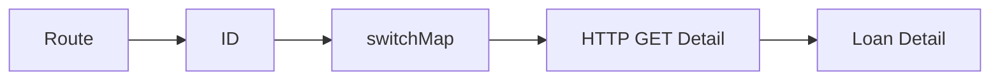

---

# 15. Kenapa `switchMap()` Disebut Latest Wins?

Misalnya:

```text
/loan/101
```

request:

```text
GET /loan/101
```

Sebelum selesai user pindah:

```text
/loan/102
```

`switchMap()` akan berpindah ke request berdasarkan:

```text
102
```

Flow:

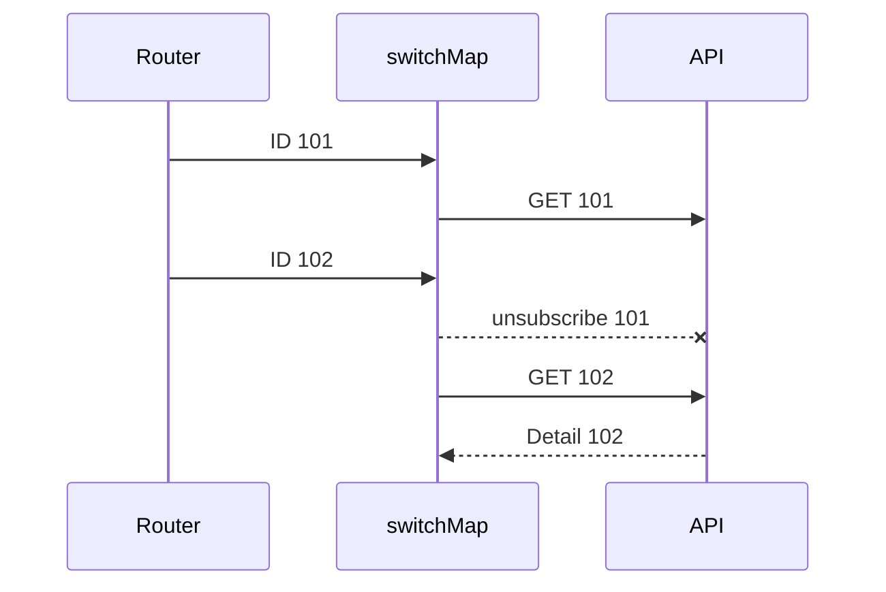

Cocok untuk:

```text
search
route parameter
filter API
dependent dropdown
autocomplete
```

---

# 16. Kapan Jangan Menggunakan `switchMap()`?

Jangan gunakan jika semua request harus tetap dijalankan.

Misalnya:

```text
upload file 1
upload file 2
upload file 3
```

atau:

```text
payment transaction
```

Untuk pembayaran, membatalkan atau mengganti request secara sembarangan bisa berbahaya.

Operator lain:

```text
concatMap
→ queue

mergeMap
→ parallel

exhaustMap
→ abaikan trigger baru selama request aktif
```

---

# 17. `take()`

`take(n)` mengambil sejumlah emission kemudian menyelesaikan subscription.

Contoh:

```ts
this.store.currentUser$.pipe(
  take(1)
).subscribe(user => {
  console.log(user);
});
```

Artinya:

```text
ambil current user sekali
lalu selesai
```

---

# 18. Contoh Kasus `take(1)`

Misalnya kita ingin membuat loan application dan hanya membutuhkan current user saat tombol ditekan.

```ts
this.authStore.user$.pipe(
  filter((user): user is User =>
    user !== null
  ),

  take(1),

  switchMap(user =>
    this.loanService.create({
      ...payload,
      createdBy: user.id,
    })
  )
).subscribe();
```

Flow:

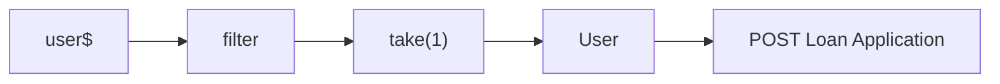

---

# 19. `take(1)` vs `takeUntilDestroyed()`

Ini berbeda.

## `take(1)`

```text
berhenti setelah menerima 1 emission
```

## `takeUntilDestroyed()`

```text
berhenti ketika Angular owner dihancurkan
```

Contoh:

```ts
user$.pipe(
  take(1)
)
```

Tidak harus menunggu component destroyed.

Setelah satu emission:

```text
subscription complete
```

---

# 20. `catchError()`

Digunakan untuk menangani error.

Contoh:

```ts
this.service.getApplications().pipe(
  catchError(error => {
    console.error(error);

    return of([]);
  })
);
```

Jika API gagal:

```text
error
 ↓
catchError
 ↓
[]
```

---

# 21. Error Handling di Store

```ts
loadApplications(): void {
  this.loadingSubject.next(true);
  this.errorSubject.next(null);

  this.service.getApplications().pipe(
    catchError(() => {
      this.errorSubject.next(
        'Gagal mengambil data'
      );

      return EMPTY;
    })
  ).subscribe(applications => {
    this.applicationsSubject.next(
      applications
    );
  });
}
```

---

# 22. `EMPTY`

`EMPTY` adalah Observable yang langsung complete tanpa menghasilkan value.

```ts
return EMPTY;
```

Artinya:

```text
jangan emit data
selesaikan stream
```

Cocok jika error sudah ditangani:

```ts
this.errorSubject.next(...)
```

---

# 23. `finalize()`

Digunakan untuk menjalankan logic setelah Observable:

```text
complete
error
unsubscribe
```

Sangat cocok untuk loading.

```ts
loadApplications(): void {
  this.loadingSubject.next(true);

  this.service.getApplications().pipe(
    finalize(() => {
      this.loadingSubject.next(false);
    })
  ).subscribe(...);
}
```

---

# 24. Kenapa `finalize()` Berguna?

Tanpa `finalize()`:

```ts
subscribe({
  next: () => {
    this.loadingSubject.next(false);
  },

  error: () => {
    this.loadingSubject.next(false);
  }
});
```

Ada duplikasi.

Dengan:

```ts
finalize(() =>
  this.loadingSubject.next(false)
)
```

lebih sederhana.

---

# 25. Store Lengkap

```ts
@Injectable({
  providedIn: 'root',
})
export class LoanApplicationStore {
  private readonly service =
    inject(LoanApplicationService);

  private readonly applicationsSubject =
    new BehaviorSubject<LoanApplication[]>([]);

  private readonly selectedApplicationSubject =
    new BehaviorSubject<LoanApplicationDetail | null>(
      null
    );

  private readonly loadingSubject =
    new BehaviorSubject(false);

  private readonly errorSubject =
    new BehaviorSubject<string | null>(null);

  readonly applications$ =
    this.applicationsSubject.asObservable();

  readonly selectedApplication$ =
    this.selectedApplicationSubject.asObservable();

  readonly loading$ =
    this.loadingSubject.asObservable();

  readonly error$ =
    this.errorSubject.asObservable();

  loadApplications(): void {
    this.loadingSubject.next(true);
    this.errorSubject.next(null);

    this.service.getApplications().pipe(
      catchError(() => {
        this.errorSubject.next(
          'Gagal mengambil loan applications'
        );

        return EMPTY;
      }),

      finalize(() => {
        this.loadingSubject.next(false);
      })
    ).subscribe(applications => {
      this.applicationsSubject.next(
        applications
      );
    });
  }

  loadDetail(id: number): void {
    this.loadingSubject.next(true);
    this.errorSubject.next(null);

    this.service.getDetail(id).pipe(
      catchError(() => {
        this.errorSubject.next(
          'Gagal mengambil detail'
        );

        return EMPTY;
      }),

      finalize(() => {
        this.loadingSubject.next(false);
      })
    ).subscribe(application => {
      this.selectedApplicationSubject.next(
        application
      );
    });
  }

  clearSelected(): void {
    this.selectedApplicationSubject.next(null);
  }
}
```

---

# 26. Menggunakan Store di List Component

```ts
@Component({
  selector: 'app-loan-list',
  templateUrl: './loan-list.html',
})
export class LoanListComponent
  implements OnInit {

  private readonly store =
    inject(LoanApplicationStore);

  readonly applications$ =
    this.store.applications$;

  readonly loading$ =
    this.store.loading$;

  readonly error$ =
    this.store.error$;

  ngOnInit(): void {
    this.store.loadApplications();
  }
}
```

---

# 27. HTML

```html
@if (loading$ | async) {
  <p>Loading...</p>
}

@if (error$ | async; as error) {
  <p>
    {{ error }}
  </p>
}

@if (
  applications$ | async;
  as applications
) {

  @for (
    application of applications;
    track application.id
  ) {

    <div>
      <strong>
        {{ application.applicationNumber }}
      </strong>

      <p>
        {{ application.customerName }}
      </p>

      <a
        [routerLink]="[
          '/loan-applications',
          application.id
        ]"
      >
        Detail
      </a>
    </div>
  }
}
```

---

# 28. Mengambil Detail dari Route Parameter

Route:

```ts
{
  path: 'loan-applications/:id',
  component: LoanApplicationDetailComponent,
}
```

Contoh URL:

```text
/loan-applications/101
```

Component:

```ts
@Component({
  selector: 'app-loan-detail',
  templateUrl: './loan-detail.html',
})
export class LoanApplicationDetailComponent {

  private readonly route =
    inject(ActivatedRoute);

  private readonly store =
    inject(LoanApplicationStore);

  readonly application$ =
    this.store.selectedApplication$;

  constructor() {

    this.route.paramMap.pipe(

      map(params =>
        params.get('id')
      ),

      filter((id): id is string =>
        id !== null
      ),

      map(Number),

      filter(Number.isFinite),

      distinctUntilChanged(),

      takeUntilDestroyed()

    ).subscribe(id => {

      this.store.loadDetail(id);

    });
  }
}
```

---

# 29. Flow Detail

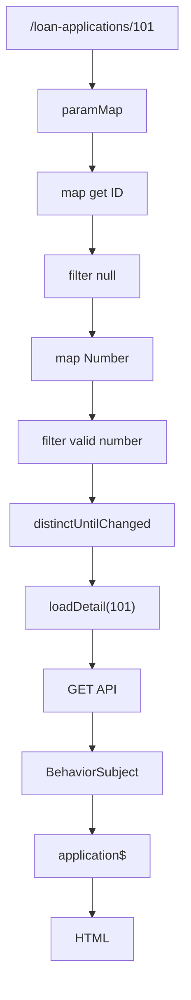

---

# 30. `takeUntilDestroyed()`

`takeUntilDestroyed()` digunakan untuk mengakhiri subscription ketika Angular context yang memiliki subscription tersebut dihancurkan.

Import:

```ts
import {
  takeUntilDestroyed
} from '@angular/core/rxjs-interop';
```

Contoh:

```ts
this.route.paramMap.pipe(
  takeUntilDestroyed()
).subscribe(...);
```

---

# 31. Kenapa Kita Membutuhkannya?

Contoh stream:

```ts
this.route.paramMap
```

dapat terus emit selama component hidup.

Jika kita melakukan:

```ts
.subscribe()
```

kita membuat manual subscription.

Ketika component dihancurkan kita biasanya tidak ingin subscriber tersebut tetap aktif.

Flow:

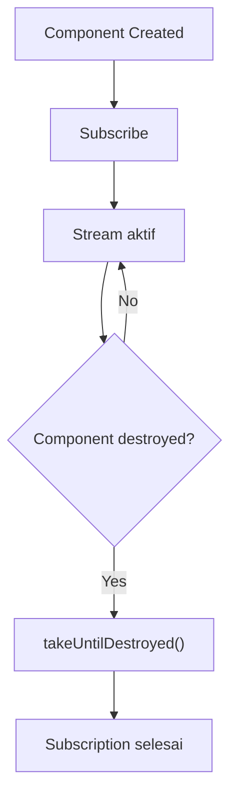

---

# 32. Kapan Harus Menggunakan `takeUntilDestroyed()`?

Gunakan terutama ketika Anda melakukan:

```ts
.subscribe()
```

terhadap Observable yang dapat hidup lama.

Contoh:

```text
ActivatedRoute.paramMap
Router.events
FormControl.valueChanges
interval()
WebSocket
Subject
BehaviorSubject
custom event stream
```

Contoh:

```ts
this.form.valueChanges.pipe(
  takeUntilDestroyed()
).subscribe(value => {
  console.log(value);
});
```

---

# 33. Kapan Tidak Perlu `takeUntilDestroyed()`?

## Async pipe

Jika:

```html
{{ user$ | async }}
```

Angular mengatur lifecycle subscription.

Tidak perlu:

```ts
user$.pipe(
  takeUntilDestroyed()
)
```

hanya untuk template.

---

## `toSignal()`

```ts
readonly user =
  toSignal(this.user$);
```

`toSignal()` secara normal sudah terintegrasi dengan Angular lifecycle.

---

## Observable Sudah Complete

Contoh:

```ts
user$.pipe(
  take(1)
)
```

Setelah satu emission:

```text
complete
```

Maka `takeUntilDestroyed()` sering tidak dibutuhkan.

---

# 34. HttpClient dan takeUntilDestroyed

Angular HttpClient Observable biasanya:

```text
request
 ↓
response
 ↓
complete
```

Jadi:

```ts
this.http.get(...).subscribe(...)
```

bukan stream yang hidup selamanya.

Namun `takeUntilDestroyed()` masih dapat berguna jika Anda ingin membatalkan subscription/request ketika component dihancurkan sebelum response selesai.

Tidak perlu menambahkan operator tersebut secara ritual ke setiap HTTP request.

---

# 35. Jangan Menggunakan takeUntilDestroyed Secara Membabi Buta

Hindari mental model:

```text
semua Observable
→ takeUntilDestroyed
```

Lebih tepat:

```text
manual subscribe?
      ↓
stream dapat hidup lama?
      ↓
subscription mengikuti lifecycle Angular?
      ↓
takeUntilDestroyed
```

---

# 36. Decision Flow

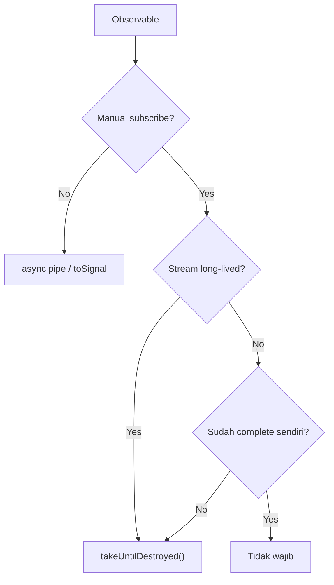

---

# 37. `takeUntilDestroyed()` vs `take(1)`

Contoh:

```ts
this.user$.pipe(
  take(1)
)
```

Artinya:

```text
berikan saya 1 value
```

Sedangkan:

```ts
this.user$.pipe(
  takeUntilDestroyed()
)
```

Artinya:

```text
terus dengarkan
sampai component destroyed
```

---

# 38. Bisa Digabung?

Bisa.

```ts
this.user$.pipe(
  filter((user): user is User =>
    user !== null
  ),

  take(1),

  takeUntilDestroyed()
)
```

Tetapi dalam banyak kasus:

```ts
take(1)
```

sudah cukup karena stream akan complete setelah satu emission.

Jangan menambahkan operator yang tidak memberikan manfaat nyata.

---

# 39. Subject `.complete()`

Misalnya Subject dimiliki component:

```ts
private readonly refresh$ =
  new Subject<void>();
```

Anda bisa:

```ts
ngOnDestroy(): void {
  this.refresh$.complete();
}
```

Namun pahami perbedaannya:

```text
takeUntilDestroyed
→ menghentikan subscriber

complete()
→ producer mengatakan stream selesai
```

---

# 40. Root Store Jangan Di-complete dari Component

Jika store:

```ts
@Injectable({
  providedIn: 'root',
})
```

maka lifetime store biasanya sama dengan aplikasi.

Jangan lakukan:

```ts
ngOnDestroy(): void {
  this.store.destroy();
}
```

hanya karena satu page ditutup.

Flow:

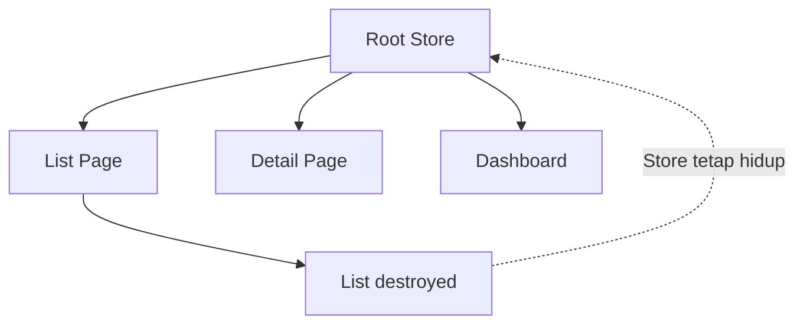

---

# 41. Owner Menentukan Lifecycle

Pertanyaan penting:

```text
Siapa yang membuat Subject?
```

Jika:

```text
Component
```

maka lifetime Subject biasanya mengikuti component.

Jika:

```text
Feature Store
```

maka mengikuti feature store.

Jika:

```text
Root Store
```

maka dapat hidup sepanjang aplikasi.

---

# 42. Hindari Nested Subscribe

Jangan:

```ts
this.route.paramMap.subscribe(params => {

  const id =
    Number(params.get('id'));

  this.service
    .getDetail(id)
    .subscribe(detail => {

      this.detail = detail;

    });

});
```

Flow:

```text
subscribe
  ↓
subscribe lagi
```

Semakin sulit mengatur:

```text
lifecycle
error
cancellation
flow
```

---

# 43. Lebih Baik dengan `switchMap()`

```ts
readonly detail$ =
  this.route.paramMap.pipe(

    map(params =>
      Number(params.get('id'))
    ),

    filter(Number.isFinite),

    distinctUntilChanged(),

    switchMap(id =>
      this.service.getDetail(id)
    )

  );
```

HTML:

```html
@if (detail$ | async; as detail) {
  {{ detail.applicationNumber }}
}
```

Bahkan tidak membutuhkan manual `subscribe()`.

---

# 44. Direct Observable vs Store

Tidak semua page membutuhkan Store.

## Tanpa Store

```text
Route
 ↓
switchMap
 ↓
API
 ↓
async pipe
```

Cocok untuk:

```text
satu detail page
tidak ada shared state
flow sederhana
```

---

# 45. Dengan Store

```text
Route
 ↓
Store
 ↓
API
 ↓
BehaviorSubject
 ↓
banyak Component
```

Cocok ketika:

```text
state digunakan banyak consumer
state perlu dibagikan
ada mutation state
ada master data reusable
```

---

# 46. Jangan Membuat Store untuk Semua Hal

Contoh:

```ts
readonly modalOpen =
  signal(false);
```

Jika hanya dipakai satu component, tidak perlu:

```ts
BehaviorSubject<boolean>
```

Gunakan:

```text
Signal
```

untuk local synchronous UI state.

---

# 47. RxJS + Signal

Angular modern tidak mengharuskan memilih salah satu.

Pendekatan yang sehat:

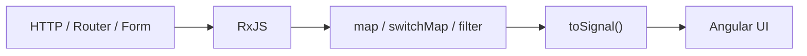

Gunakan:

```text
RxJS
→ asynchronous workflow

Signal
→ synchronous UI state
```

---

# 48. Store Berbasis BehaviorSubject Cocok untuk Apa?

Contoh:

```text
Current User
Permission
Selected Branch
Master Loan Product
Loan Application List
Selected Application Detail
Notification State
```

Tetapi jangan otomatis menyimpan semua API response ke global store.

---

# 49. Contoh Master Data Store

```ts
@Injectable({
  providedIn: 'root',
})
export class LoanProductStore {

  private readonly service =
    inject(LoanProductService);

  private readonly productsSubject =
    new BehaviorSubject<LoanProduct[]>([]);

  readonly products$ =
    this.productsSubject.asObservable();

  loadProducts(): void {

    this.service.getProducts()
      .subscribe(products => {

        this.productsSubject.next(
          products
        );

      });

  }
}
```

Digunakan:

```text
Loan Application Form
Loan Plafond Form
Loan Product Management
```

---

# 50. Insight: BehaviorSubject Bukan Database

BehaviorSubject menyimpan data:

```text
di memory browser
```

Refresh browser:

```text
state hilang
```

Jangan menggunakan frontend store sebagai source of truth untuk:

```text
payment
plafond
balance
installment
approval
```

Source of truth tetap backend.

---

# 51. Mutation Sebaiknya Refresh Authoritative Data

Contoh:

```ts
pay(payload: PaymentRequest): void {

  this.paymentService
    .pay(payload)
    .pipe(

      switchMap(() =>
        this.paymentService.getPayments()
      )

    )
    .subscribe(payments => {

      this.paymentsSubject.next(
        payments
      );

    });

}
```

Flow:

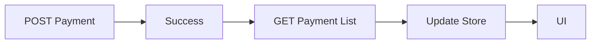

---

# 52. Jangan Retry Mutation Sembarangan

Hindari:

```ts
this.paymentService.pay(payload).pipe(
  retry(3)
)
```

tanpa backend idempotency yang jelas.

Risiko:

```text
double transaction
duplicate payment
duplicate submission
```

Retry lebih aman untuk operasi:

```text
GET
```

yang idempotent.

---

# 53. Operator Penting Lainnya

Selain operator utama tadi, pelajari juga:

```text
tap
finalize
distinctUntilChanged
debounceTime
startWith
combineLatest
withLatestFrom
concatMap
mergeMap
exhaustMap
```

Tetapi tidak perlu digunakan semuanya dalam satu pipeline.

---

# 54. `tap()`

Gunakan untuk side effect.

```ts
this.service.getDetail(id).pipe(

  tap(detail =>
    console.log(detail)
  )

);
```

Cocok:

```text
logging
analytics
debugging
minor side effects
```

Jangan gunakan untuk transform data.

Gunakan:

```ts
map()
```

untuk transform.

---

# 55. `distinctUntilChanged()`

```ts
this.route.paramMap.pipe(

  map(params =>
    params.get('id')
  ),

  distinctUntilChanged()

)
```

Jika:

```text
101
101
101
102
```

hasil:

```text
101
102
```

---

# 56. `debounceTime()`

Search:

```ts
this.searchControl
  .valueChanges
  .pipe(

    debounceTime(300),

    distinctUntilChanged(),

    switchMap(keyword =>
      this.service.search(keyword)
    )

  );
```

Menghindari API request setiap user mengetik satu karakter.

---

# 57. `startWith()`

Refresh:

```ts
refresh$.pipe(

  startWith(undefined),

  switchMap(() =>
    this.service.getList()
  )

)
```

Tanpa `startWith()`:

```text
API baru dipanggil setelah Refresh
```

Dengan:

```text
page load
→ API langsung berjalan
```

---

# 58. `exhaustMap()` untuk Submit

Contoh pembayaran:

```ts
submit$.pipe(

  exhaustMap(payload =>
    this.paymentService.pay(payload)
  )

)
```

Jika user double-click:

```text
klik 1
→ request

klik 2
→ diabaikan sementara
```

Cocok untuk:

```text
payment
checkout
login
submit form kritikal
```

---

# 59. `concatMap()` untuk Queue

```ts
from(documents).pipe(

  concatMap(document =>
    this.documentService.upload(
      document
    )
  )

)
```

Flow:

```text
Document A
 ↓ selesai
Document B
 ↓ selesai
Document C
```

---

# 60. `mergeMap()` untuk Parallel

```ts
from(images).pipe(

  mergeMap(
    image =>
      this.imageService.upload(image),

    3
  )

)
```

Maksimal:

```text
3 request paralel
```

---

# 61. Cheat Sheet Operator

| Masalah                             | Operator                 |
| ----------------------------------- | ------------------------ |
| Ubah value                          | `map()`                  |
| Validasi/buang emission             | `filter()`               |
| Ambil sekali                        | `take(1)`                |
| Route → API                         | `switchMap()`            |
| Search → API                        | `switchMap()`            |
| Error handling                      | `catchError()`           |
| Reset loading                       | `finalize()`             |
| Debugging                           | `tap()`                  |
| Prevent duplicate consecutive value | `distinctUntilChanged()` |
| Search delay                        | `debounceTime()`         |
| Initial trigger                     | `startWith()`            |
| Cleanup lifecycle                   | `takeUntilDestroyed()`   |
| Queue                               | `concatMap()`            |
| Parallel                            | `mergeMap()`             |
| Anti-double-submit                  | `exhaustMap()`           |

---

# 62. Cheat Sheet Lifecycle

```text
async pipe
→ Angular cleanup

toSignal()
→ Angular cleanup

take(1)
→ complete setelah satu emission

HttpClient
→ biasanya complete setelah response

manual subscribe ke Router/Form/WebSocket/Subject
→ pertimbangkan takeUntilDestroyed()

component-local Subject
→ boleh complete saat owner destroyed

root BehaviorSubject
→ jangan complete hanya karena satu component destroyed
```

---

# 63. Recommended Flow untuk Detail Page

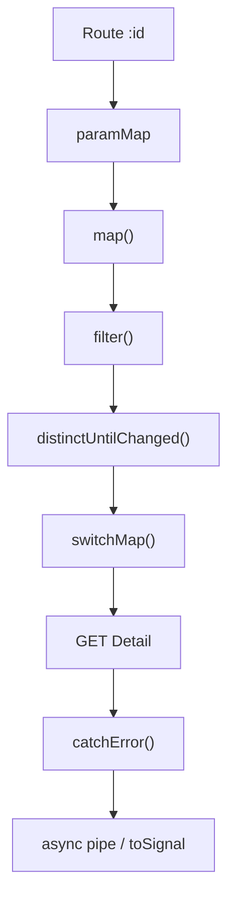

Jika detail perlu shared state:

```text
switchMap / Store
→ BehaviorSubject
→ banyak consumer
```

---

# 64. Recommended Flow Store

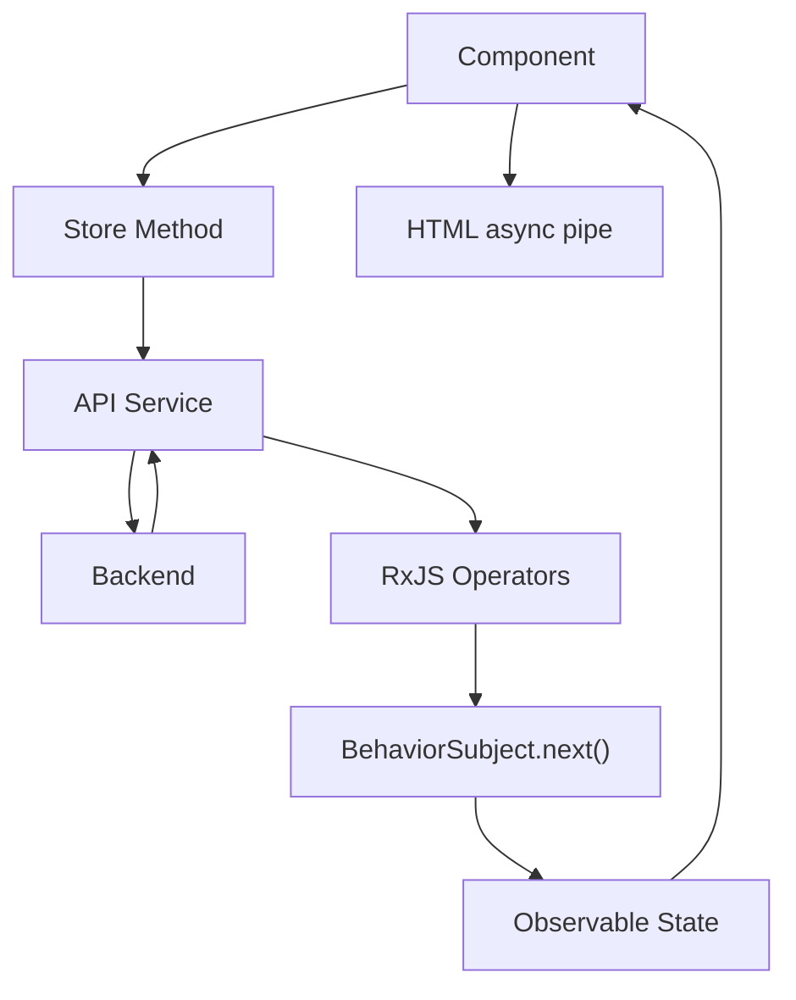

---

# 65. Hal Penting yang Harus Diingat

### 1. Jangan menggunakan RxJS untuk semua variable

Local UI state:

```ts
signal()
```

sering lebih sederhana.

### 2. Subject untuk event

```text
Refresh
Retry
Submit
```

### 3. BehaviorSubject untuk state

```text
Current user
Selected loan
Master data
```

### 4. Hindari nested subscribe

Gunakan:

```text
switchMap
```

### 5. Jangan expose Subject

Gunakan:

```ts
private subject
public observable
```

### 6. Jangan menggunakan `takeUntilDestroyed()` tanpa memahami alasannya

Gunakan terutama untuk manual subscription yang mengikuti lifecycle Angular.

### 7. Route parameter dapat menjadi source of truth

```text
/loan-applications/101
```

Tidak perlu menduplikasi ID `101` ke global state tanpa alasan.

### 8. Store bukan database

Backend tetap source of truth.

---

# 66. Final Mental Model

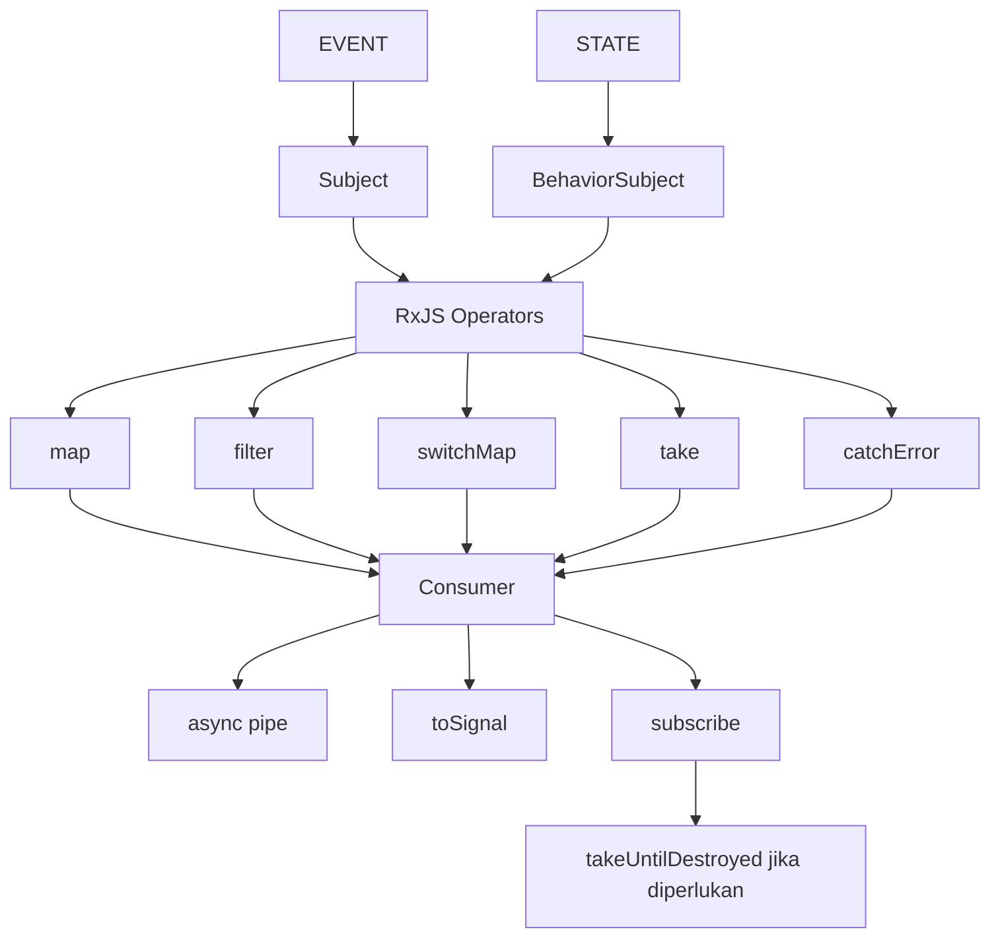

---

# 67. Kesimpulan

Gunakan mental model berikut:

```text
Observable
= stream

Subject
= event

BehaviorSubject
= current state

map
= transform

filter
= pilih emission

switchMap
= pindah ke Observable terbaru

take(1)
= ambil sekali

catchError
= tangani error

finalize
= cleanup setelah stream selesai

takeUntilDestroyed
= hentikan subscription ketika Angular owner destroyed

async pipe
= Angular konsumsi Observable

Store
= owner dari shared state
```

Arsitektur sederhana yang direkomendasikan:

```text
Component
   ↓
Store
   ↓
API Service
   ↓
Backend
   ↓
Store
   ↓
BehaviorSubject
   ↓
Observable
   ↓
async pipe / toSignal
   ↓
HTML
```

Prinsip akhirnya:

> Gunakan RxJS untuk menyelesaikan masalah **asynchronous flow**, gunakan Store ketika state memang perlu dibagikan, dan jangan membuat pipeline atau global state lebih kompleks daripada kebutuhan aplikasinya.
